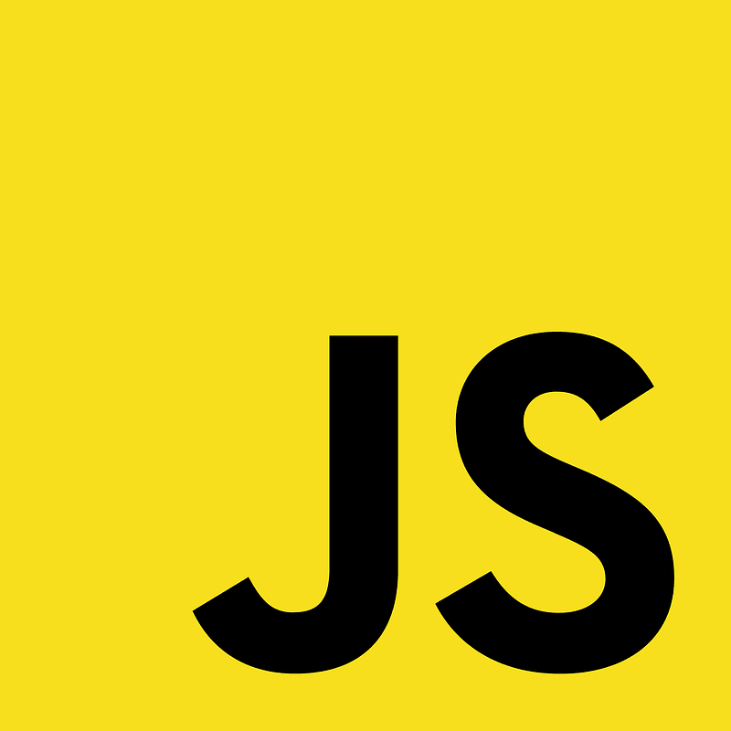
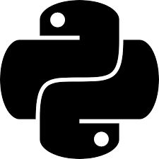

# **ChickCoder**
Hi! I'm a front-end (hopefully eventually full stack) web developer. I make programs on [Khan Academy](khanacademy.org/profile/websitedeveloper). Have a good day! 😃

# Fluent Languages

 
  
  
  
  
  
  
  

# Footer

   
      
  ChickCoder 2023

